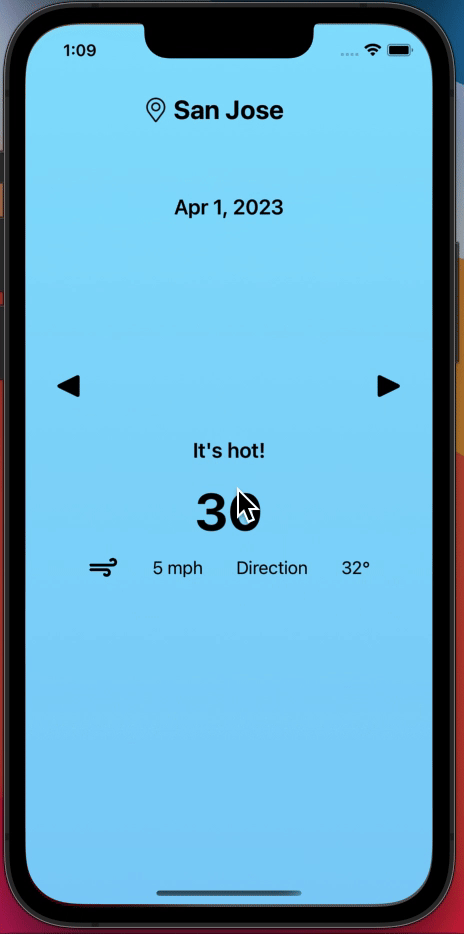

# CloudCast iOS 🌤  
***by Andry Rakotonjanabelo***


A sleek and simple weather app built using Swift and OpenWeatherAPI to deliver accurate and real-time weather information!

## Features  
- 🌎 Current weather by location  
- 📍 Search weather for different cities  
- 🛰 Real-time data fetched via OpenWeatherAPI  

## Walkthrough 🌟  


This is lab 4 of CodePath's Introduction to iOS Development Course, Spring 2025.
## Getting Started  
1. Clone the repo:  
   ```bash  
   git clone https://github.com/Andry-Arthur/CloudCast-iOS.git

2. (Optional) Adding a custom location:
    - Go to ForecastViewController.swift and append your wanted location in the `locations` list
    - Location format for list: Location(name, latitude, longitude)
